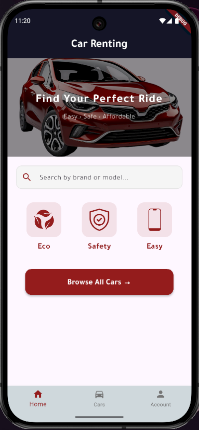
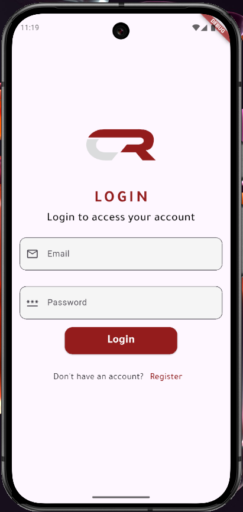
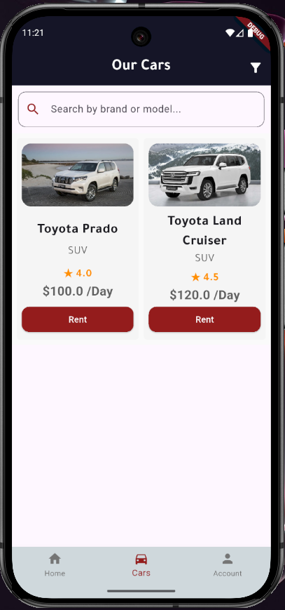
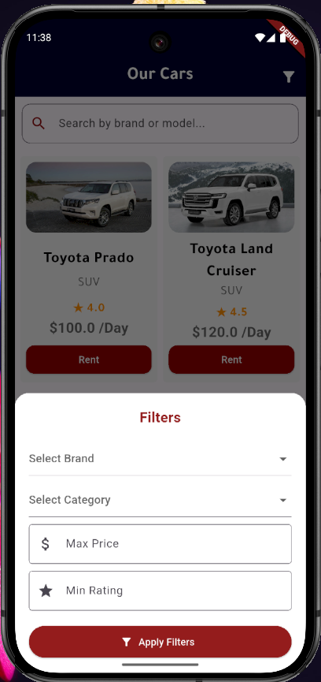
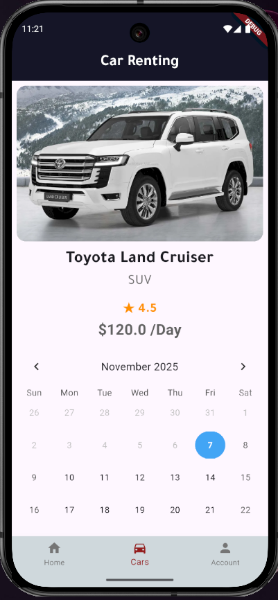
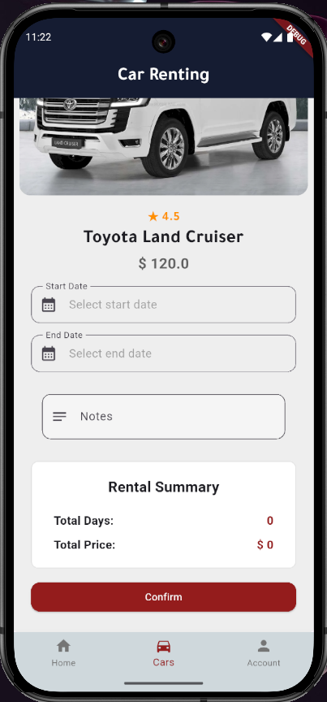
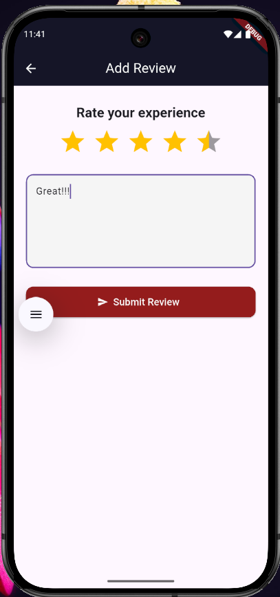
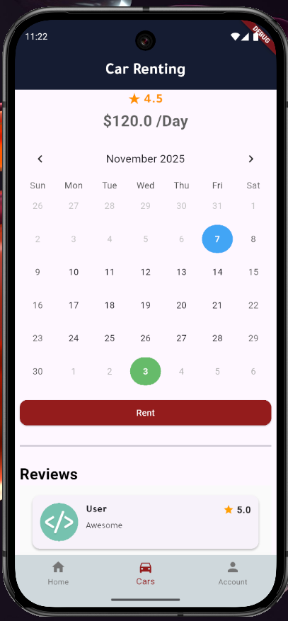
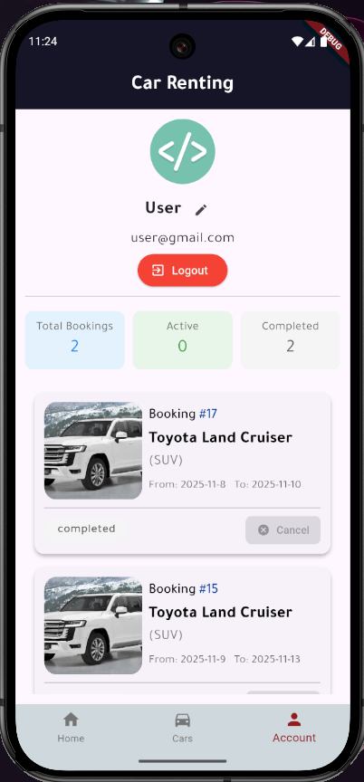

# Car Renting - Car Rental Mobile App

A modern, cross-platform car rental application built with **Flutter**. Car Renting offers a seamless user experience for browsing, filtering, renting, and reviewing cars.  
Designed for individuals who want a fast and convenient way to rent cars on mobile devices.



---

## 📱 Application Screenshots

| | | |
|:-------------------------:|:-------------------------:|:-------------------------:|
| **Login Screen** <br>  | **Home Page** <br>  | **Cars Listing** <br>  |
| **Smart Filters** <br>  | **Car Details** <br>  | **Renting Process** <br>  |
| **Rate & Review** <br>  | **User Reviews** <br>  | **User Profile** <br>  |

---

## ✨ Features

### User Features
- **User Authentication:** Secure login and profile management
- **Browse Cars:** View an extensive catalog of available cars
- **Smart Filtering & Search:** Find the perfect car using various filters (brand, category, price, rating)
- **Detailed Car Views:** High-quality images, specifications, and pricing
- **Seamless Renting:** Intuitive process to select dates and confirm rentals
- **Rating & Review System:** Share feedback and read reviews from other users
- **Profile Management:** View rental history and manage personal information

### Technical Features
- **Cross-Platform:** Runs seamlessly on both iOS and Android
- **Clean Architecture:** Well-structured and maintainable codebase
- **Responsive UI:** Optimized for various screen sizes
- **State Management:** Efficient state handling using Provider
- **HTTP Client:** API integration with Dio for backend communication

---

## 🛠️ Tech Stack

- **Framework:** [Flutter](https://flutter.dev/) (Version 3.x recommended)
- **Language:** Dart (Version 3.x recommended)
- **State Management:** Provider
- **HTTP Client:** Dio
- **Backend:** Laravel REST API

---

## 🚀 Getting Started

### Prerequisites
- Flutter SDK
- Dart
- IDE (Android Studio, VS Code, IntelliJ IDEA)
- Android/iOS emulator or physical device

### Installation

1. **Clone the repository**
   ```bash
   git clone https://github.com/Ahmed-Al-Hemyari/Car-Renting-as-Mobile-app.git
   cd driverent-flutter-app
   ```

2. **Install dependencies**
   ```bash
   flutter pub get
   ```

3. **Run the app**
   ```bash
   flutter run
   ```

### Build Instructions

**For Android**
```bash
flutter build apk
```

**For iOS**
```bash
flutter build ios
```

> Note: Ensure proper signing and provisioning profiles for iOS builds.

---

## 🔗 Backend Integration

This mobile app connects to a custom **Laravel REST API backend** that handles:

- User authentication and authorization
- Car inventory management
- Booking and rental processing
- Review and rating system

> Backend code is maintained in a separate repository (link can be added here if public).

---

## 👨‍💻 Developer

**Ahmed Al-Hemyari**  
- LinkedIn: [https://www.linkedin.com/in/ahmed-alhemyari/](https://www.linkedin.com/in/ahmed-alhemyari/)  
- Email: ahmed.a.alhemyari@gmail.com  
- GitHub: [https://github.com/Ahmed-Al-Hemyari](https://github.com/Ahmed-Al-Hemyari)


# Car-Renting-as-Mobile-app
A modern mobile application built with flutter (dart), connected to Laravel elegant backend management with a dynamic, responsive frontend.
